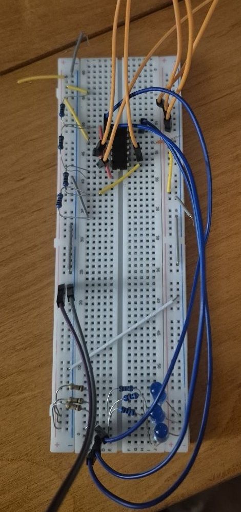

# 2 Bit Flash ADC Project  

## Table of Contents

- [Summary](#summary)
- [Design Specifications](#design-specifications)
- [Project Diary](#project-diary)  
    -[May 1 2026](#May-1-2026)  
    -[June 7 2026](#June-7-2026)  

## Summary  

As of April 2026, I have taken both analog and digital circuits classes. I wanted to build project that took theory from both and applied it toward a useful end-goal. I decided to build a flash analog to digital converter.

For those who don't know-- an analog to digital converter uses a reference-voltage resistor ladder to establish threshold voltages. These references voltages can be compared to some input using comparator IC or a rail to rail op-amp-- I use the former. If the input is higher than the reference the op-amp lights up an LED corresponding to the threshold voltage it surpassed. This is what is known as thermometer code.

## Design Specifications

* 4 1k resistors to create reference ladder
* 1 LM339AN Comparator IC
* 3 LEDs
* 1 ESP32 w/ USB-C connection
* 3 Open Collector Resistors (I used 10k)
* Computer with VSCode and PlatfromIO

## Project Diary

### May 1 2026

 I tried multiple chips from lab work I had done in the past such as TL071CP and CD4007, but kept finding errors in the output close to the boundary voltages set by the supply rails. After describing the phenomenon I was seeing to ChatGPT, I was recommended to find a rail-to-rail op-amp which is an op-amp that can both sense and output voltages all the way to its supply voltages. 

After being unable to find a rail-to-rail op amp in the lab, I switched to using a dedicated comparator IC better suited for the ADC application-- LM339AN,. Going forward,  I expected everything to work perfectly but found myself struggling again with unexpected outputs—output was never high. After reading some more on the chip, I realized that the chip used an open collector output meaning it will simply pull the output low if the reference is lower than the input. In the case of it being higher, output needed to be pulled up via a connection to a 3.3 V power rail through a resistor. Once I understood this, I rebuilt the circuit and tested each comparator output against a DC input of my choosing to confirm I was getting the output I expected by seeing if output lit up an LED or not.

 As of May 1, 2026 it is able to convert an input signal to Thermometer code by comaring input to the threshold voltages created by the resistor ladder. 

### June 7 2026

By researching online, I found that I needed to connect my three comparator outputs to the GPIO pins on the ESP32. After connecting the chip to a common ground, I plugged the chip into my computer to build the code that would transform the voltages at the GPIOs from thermometer code to binary

I used Claude to help me write the C++ code I needed to flash onto the device via PlatformIO and VSCode. This was a process of many failures; I got some compiler errors I knew how to fix on my own and others error fixes were suggested by describing what I had changed and what the specific error was to Claude. This helped me fix problems such as altering the refresh rate as well as navigating around a new development environment I had never used before. Eventually I achieved a variable 2 bit binary output in response to the input voltage which may be seen in the video I took in UW lab below:

